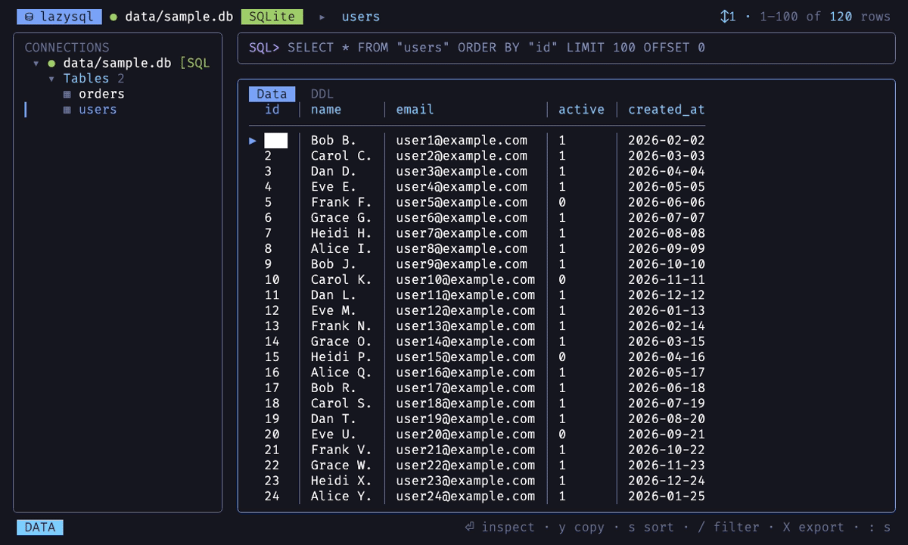

# lazysql

**English** · [简体中文](README.zh-CN.md)

[](https://www.npmjs.com/package/@vascent/lazysql)
[](LICENSE)


> A lazygit-style terminal database client (TUI). Keyboard-driven, panel-based, cross-database, and generates SQL from natural language — all without leaving the keyboard.

Work with databases in your terminal the way lazygit works with git: connect, browse, edit, query, manage schema.

<!-- Demo: record a GIF, drop it at docs/assets/demo.gif, then replace this comment with:  -->

## ✨ Features

- 🔌 **Multiple data sources**: PostgreSQL · MySQL/MariaDB · SQLite · MongoDB · Redis
- 📊 **Browse / edit**: pagination · column sort · column filter · row-level edit and delete (parameterized, run inside a real transaction, auto-rollback when `affected≠1`)
- ⌨️ **SQL editor**: **multi-line editing** · execute · per-connection persistent history (`^P/^N`) · **schema-aware completion** (table names / column names scoped by FROM / keywords, toggle with `^T`)
- 📤 **Data export**: to **CSV · JSON · SQL** — the current grid view, a whole table, an entire schema/category, or a multi-select of tables (`v` to mark); streamed to disk at constant memory, cancellable (`esc`), with a live row count. CSV writes one file per table; JSON and SQL each combine into a single file
- 🧬 **Schema introspection**: tables / views / indexes / sequences / triggers / stored procedures; inspect an object's columns and DDL definition
- 🛡️ **Destructive-operation guard**: a `WHERE`-less `UPDATE/DELETE`, `DROP`, or `TRUNCATE` always pops a **centered confirmation dialog** echoing the full SQL to be run; when a Postgres `DROP` fails due to dependents, it offers a `CASCADE` retry and **names the objects that would be dropped along with it**
- 🌳 **Live tree sync**: the object tree refreshes automatically after a successful DDL (`CREATE/DROP/ALTER/…`)
- 🤖 **NL→SQL**: press `^G`, type natural language, and the LLM generates SQL **placed into the editor for review** (never auto-executed); destructive statements are flagged with a red ⚠
- 🗂️ **Connection management**: multi-connection config · create / edit / test connections in-TUI · passwords stored separately from config (optional OS Keychain)
- 🖱️ **Modern terminal UX**: mouse / scroll wheel · system-clipboard copy · full-cell inspector (long text wraps by display width, no CJK truncation)

## 📦 Installation

**Ready to run, no Bun required** — prebuilt `bun --compile` native binaries are distributed via npm, one per platform; only the one matching your system gets installed. Supports **macOS (Apple Silicon) · Linux (x64 / arm64) · Windows (x64)**.

### Package managers (recommended)

| Method | Command |
|------|------|
| npm | `npm i -g @vascent/lazysql` |
| bun | `bun add -g @vascent/lazysql` |
| Try without installing | `npx @vascent/lazysql --list` |

Then just type `lazysql`.

> When installing with `bun add -g`, if `lazysql` reports command not found, Bun's global directory `~/.bun/bin` isn't on your `PATH` — `bun add -g` usually prints a hint to add it (`npm i -g` generally doesn't have this issue).

### From source (to try unreleased changes)

To run the latest unreleased code, or use your local edits right away:

```bash
git clone https://github.com/Yangeyu/lazysql && cd lazysql
bun install
bun link            # register a global lazysql → ~/.bun/bin/lazysql (symlinked to this repo)
```

`bun link` puts the command in Bun's global directory `~/.bun/bin`; make sure it's on your `PATH` (`command -v lazysql` returns a path). If not, add one line — **exactly the same config `bun add -g` needs**:

```bash
echo 'export PATH="$HOME/.bun/bin:$PATH"' >> ~/.zshrc && source ~/.zshrc
```

The symlink points at the repo, so `git pull` or code edits take effect immediately — no reinstall; undo with `bun unlink` inside the repo.

### Upgrade

```bash
npm i -g @vascent/lazysql@latest      # bun: bun add -g @vascent/lazysql@latest
```

A from-source install upgrades via `git pull` — the symlink picks it up immediately.

### Uninstall

```bash
npm un -g @vascent/lazysql            # bun: bun remove -g @vascent/lazysql; from source: bun unlink
```

Uninstalling only removes the program itself. Config and history (connections, passwords, SQL history) stay in `~/.config/lazysql/`; to wipe them too:

```bash
rm -rf ~/.config/lazysql
```

> On macOS, if you ever set `LAZYSQL_SECRETS=keychain`, passwords live in the system keychain and aren't removed by deleting `~/.config/lazysql` — search for `lazysql` in Keychain Access and delete the matching entries manually.

## 🚀 Usage

```bash
lazysql                   # open the default (first saved) connection
lazysql <name>            # open a saved connection by id / name
lazysql <file.db>         # open an ad-hoc SQLite file
lazysql --list            # list saved connections and exit
```

The first run auto-creates `~/.config/lazysql/connections.yml`. Inside the TUI: press `?` for the full keymap, `` ` `` to switch connections, and `n` to create one — see the **Keybindings** section below for the rest.

## ⌨️ Keybindings

vim-style, panel-based. Grouped by context below; the full list is in-app via `?` (the footer and help both render from the same keymap table, so they never drift).

**Global**

| Key | Action |
|----|------|
| `` ` `` | Switch connection (back to the picker) |
| `:` | Open the SQL editor |
| `tab` | Toggle focus between tree ↔ results |
| `^⇧-` / `^⇧+` | Shrink / widen the connections sidebar |
| `?` | Toggle help |
| `q` | Quit |

**Sidebar (tree)**

| Key | Action |
|----|------|
| `k` / `j` · `↑` / `↓` | Move selection |
| `⏎` / `space` | Expand / collapse / open object |
| `→` / `l` | Expand |
| `←` / `h` | Collapse / jump to parent |
| `a` | Clean `SELECT *` browse of the selected table |
| `v` | Mark / unmark a table for a batch export (multi-select) |
| `X` | Export — marked tables, else all tables under the node (schema / category), else this one |
| `esc` | Clear all export marks |
| `g` / `G` | Jump to first / last |
| `D` | View the object's DDL / structure |
| `d` | Draft a `DROP` into the editor |
| `r` | Refresh connection and object tree |
| `n` / `e` | New / edit connection |
| `x` | Remove the selected connection |

**Results grid**

| Key | Action |
|----|------|
| `k` / `j` | Move row cursor |
| `h` / `l` · `←` / `→` | Move column cursor · horizontal scroll for wide tables |
| `g` / `G` | Jump to first / last row |
| `^u` / `^d` | Half page up / down |
| `⏎` | Inspect the full cell value |
| `a` | Browse the selected table (`SELECT *`) |
| `s` | Cycle sort (asc → desc → none) |
| `/` | Filter by column substring |
| `e` / `d` | Edit cell / delete row |
| `X` | Export the view — a browsed table to CSV / JSON / SQL (filtered & sorted), a query result to CSV / JSON |
| `n` / `p` | Next / previous page |
| `D` | Toggle Data / DDL tab |

**SQL editor**

| Key | Action |
|----|------|
| `⏎` | Run the query (results show in the grid) |
| `⇧⏎` | Insert a newline — compose multi-line SQL |
| `tab` | Accept completion, otherwise move to the next panel |
| `^P` / `^N` | Previous / next history entry |
| `^T` | Toggle schema-aware completion |
| `^G` | Generate SQL from natural language |
| `^C` | Clear the draft |
| `esc` | Back to the results grid |

**Confirmation dialog**

| Key | Action |
|----|------|
| `y` | Apply the pending write / run the export |
| `n` | Cancel |
| `f` | Cycle export format (CSV / JSON / SQL) — export confirm only |

**Cell inspector**

| Key | Action |
|----|------|
| `j` / `k` · `↑` / `↓` | Scroll the value |
| `e` | Edit the cell in place |
| `y` | Copy the full value to the clipboard |
| `esc` / `⏎` | Close |

**New / edit connection form**

| Key | Action |
|----|------|
| `↑` / `↓` | Move between drivers and fields |
| `←` / `→` | Switch driver (on the Driver row) |
| `^R` | Show / hide password |
| `^T` | Test the connection (without saving) |
| `⏎` | Save the connection |
| `esc` | Cancel |

## ⚙️ Configuration

All under `~/.config/lazysql/`:

| File | Contents |
|------|------|
| `connections.yml` | Connection config, **no passwords**, editable by hand |
| `secrets.json` | Passwords (`chmod 600`) |
| `config.yml` | App settings (incl. the NL→SQL `llm:` block) |
| `history.json` | Per-connection SQL history (capped at 100 entries each) |

Passwords default to `secrets.json`; on macOS, set `LAZYSQL_SECRETS=keychain` to use the system keychain instead (zero native dependencies).

### NL→SQL (LLM)

The provider is isolated behind the `SqlGenerator` port; **without an API key, `^G` is silently disabled**. Pin it in `config.yml`, or override temporarily with environment variables (env wins). **The API key is read only from the environment, never written to config.yml.**

`config.yml`:

```yaml
llm:
  provider: alibaba        # anthropic | alibaba | openai | deepseek
  model: qwen3.7-plus      # optional, overrides the default model
  # baseUrl: https://...   # optional, overrides the default base URL (e.g. an overseas endpoint)
```

| Provider | id | API key env var | Default model |
|----------|----|------------------|----------|
| Alibaba Cloud (Qwen) | `alibaba` | `DASHSCOPE_API_KEY` | `qwen3.7-plus` |
| OpenAI | `openai` | `OPENAI_API_KEY` | `gpt-4o` |
| DeepSeek | `deepseek` | `DEEPSEEK_API_KEY` | `deepseek-chat` |
| Anthropic (Claude) | `anthropic` | `ANTHROPIC_API_KEY` | `claude-opus-4-8` |

When no `provider` is set explicitly, it's auto-detected by "which API key exists" (Qwen first, Anthropic last). Each run can also override with `LAZYSQL_LLM_PROVIDER` / `LAZYSQL_LLM_MODEL` / `LAZYSQL_LLM_BASE_URL`.

```bash
export DASHSCOPE_API_KEY=sk-xxx && lazysql              # Qwen by default
ANTHROPIC_API_KEY=sk-ant-xxx LAZYSQL_LLM_PROVIDER=anthropic lazysql  # temporarily switch to Claude
```

## 🏗️ Architecture

**Tech stack**: `TypeScript (strict)` · `Bun` · `OpenTUI` (`@opentui/react` + React 19) · `Zustand` · `yaml`. LLM via `@anthropic-ai/sdk` + any OpenAI-compatible backend (Qwen / OpenAI / DeepSeek).

**Clean / Hexagonal** layering, built around a **capability-segmented `DataSource` port** — the UI asks a data source "which capabilities do you support" (`Queryable` / `Browsable` / `RowEditable` / `Transactional` / …) rather than "what type are you", so adding a database = adding one adapter, with zero changes to the core. Every layer boundary is crossed via a `Result<T,E>` + port handshake; inner layers never depend on outer ones.

```
src/
  domain/         pure business rules / entities / value objects (no IO)
  application/    ports (outbound interfaces) + usecases (use-case orchestration)
  adapters/       datasource · llm · persistence · clipboard (real IO)
  presentation/   app · components · keymap · tree (TUI, unidirectional data flow + Zustand)
  shared/         cross-layer pure utilities (e.g. Result)
```

The source of truth for the design is **[docs/ARCHITECTURE.md](docs/ARCHITECTURE.md)**; key decisions are recorded in **[docs/adr/](docs/adr/)** (capability model, TUI framework, NL→SQL provider strategy, key dispatch, etc.).

## 🛠️ Development

> Requires [Bun](https://bun.sh). SQLite uses Bun's built-in `bun:sqlite` — no native dependency.

```bash
bun install        # install dependencies
bun run seed       # generate the sample DB data/sample.db
bun start          # run from source (the launch-arg forms from Usage work here too, e.g. bun start <name>)
```

### Tests

```bash
bun run typecheck   # strict type check
bun test            # unit + five-engine adapter contracts + persistence + headless TUI integration
```

The objective judge of "done" is `bun run typecheck && bun test` all green. Every data-source adapter passes **the same contract test suite** (the executable acceptance of LSP); contract tests need a reachable real database and **skip automatically when unreachable**, so a machine without Docker won't fail. To run the full contracts, start the matching containers:

```bash
# PostgreSQL
docker run -d --name lazysql-pg -e POSTGRES_PASSWORD=lazysql \
  -e POSTGRES_USER=lazysql -e POSTGRES_DB=lazysql -p 5432:5432 postgres:16-alpine
# MySQL / MariaDB
docker run -d --name lazysql-mysql -e MARIADB_ROOT_PASSWORD=lazysql -p 3306:3306 mariadb:11
# MongoDB
docker run -d --name lazysql-mongo -p 27017:27017 mongo:7
# Redis
docker run -d --name lazysql-redis -p 6379:6379 redis:7-alpine
```

Contributors: please read **[CLAUDE.md](CLAUDE.md)** (working rules: layering, naming, commit conventions) and **[docs/ARCHITECTURE.md](docs/ARCHITECTURE.md)** first. Commits follow Conventional Commits (enforced by `.githooks` + commitlint); on `bun install`, the `prepare` script points `core.hooksPath` at `.githooks`.

## 📄 License

[MIT](LICENSE) © yangwb
